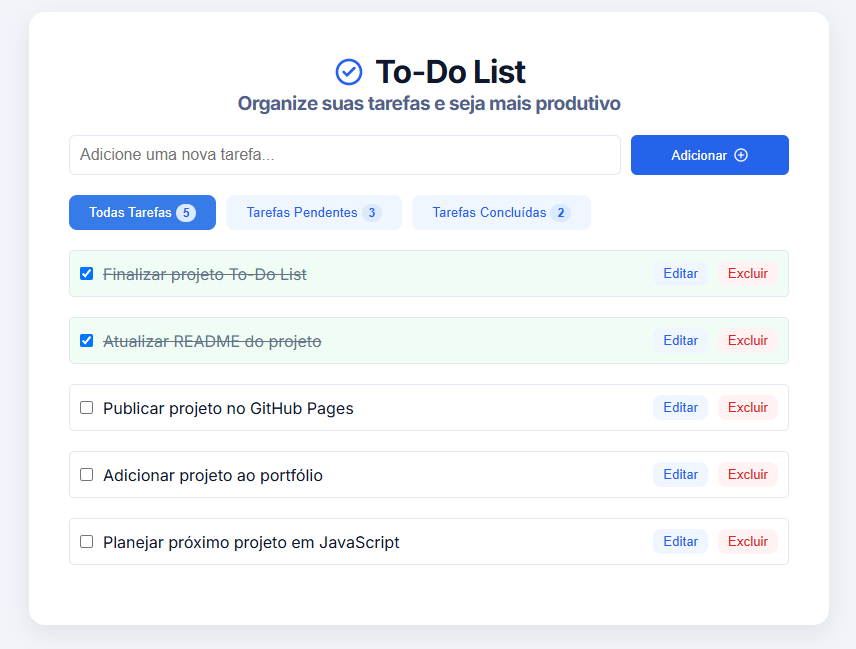
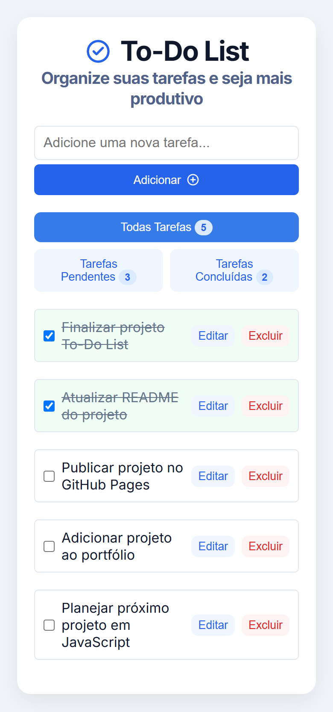

# To-Do List

Aplicação de gerenciamento de tarefas desenvolvida com JavaScript Vanilla.

O projeto permite criar, editar, excluir e marcar tarefas como concluídas, além de filtrar as tarefas por status. Os dados são armazenados no LocalStorage, mantendo as tarefas salvas mesmo após fechar ou atualizar a página.

## Demo

[Acessar aplicação](https://italomartinsg.github.io/javascript-todo-list/)

## Preview



### Versão mobile



## Funcionalidades

- Adicionar novas tarefas
- Editar tarefas existentes
- Excluir tarefas
- Marcar tarefas como concluídas ou pendentes
- Filtrar por todas, pendentes e concluídas
- Exibir a quantidade de tarefas em cada filtro
- Salvar as tarefas no LocalStorage
- Recuperar automaticamente as tarefas salvas
- Validar os dados inseridos pelo usuário
- Tratar dados inválidos armazenados no LocalStorage
- Layout responsivo para desktop e dispositivos móveis

## Tecnologias

- HTML5
- CSS3
- JavaScript (ES6+)

## Conceitos praticados

Durante o desenvolvimento do projeto, trabalhei principalmente com:

- Manipulação do DOM
- Criação dinâmica de elementos
- Eventos e delegação de eventos
- Métodos de Array como `forEach()`, `filter()`, `find()`, `findIndex()` e `reduce()`
- Atributos `data-*` e `dataset`
- Seletores de atributos
- Uso de `closest()` na manipulação de eventos
- LocalStorage
- `JSON.stringify()` e `JSON.parse()`
- Validação de dados e tratamento de erros
- Responsividade com CSS e Media Queries

## Como executar

Clone o repositório:

```bash
git clone https://github.com/italomartinsg/javascript-todo-list.git
```

Acesse a pasta do projeto:

```bash
cd javascript-todo-list
```

Depois, abra o arquivo `index.html` no navegador.
